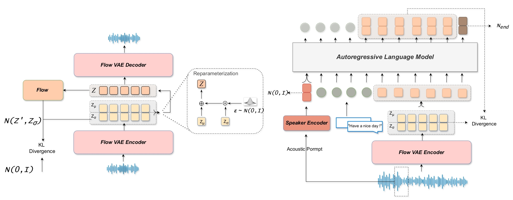
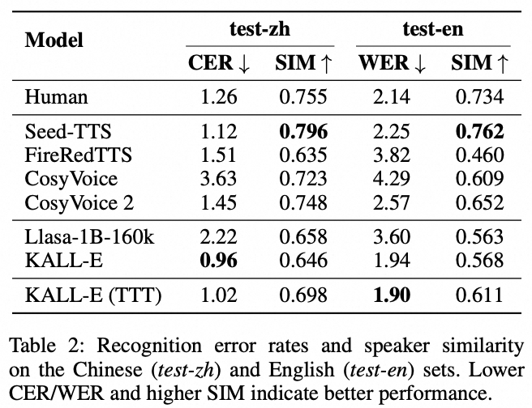
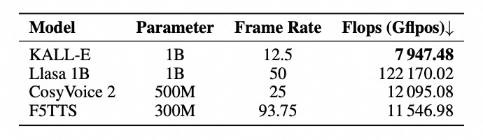
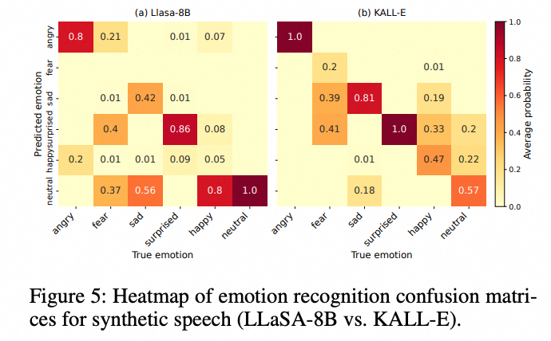

# 🎙️ KALL-E: Autoregressive Speech Synthesis with Next-Distribution Prediction

[](https://github.com/xkx-hub/KALL-E)  [](https://arxiv.org/abs/2412.16846) [](https://nwpu-aslp.feishu.cn/wiki/TfLEwoITwiTReakgfnPczGfunzh?from=from_copylink) [](https://huggingface.co/kxxia/KALL-E)


## News

* [2025.08.05] 🔥 🔥 🔥  We release the inference code of [KALL-E](https://github.com/xkx-hub/KALL-E)!
* [2025.09.17] 🎉 🎉 🎉  KALL-E's paper is updated on [arxiv](https://arxiv.org/abs/2412.16846), read it now! 
* [2025.09.24] 🔥 🔥 🔥  We release the KALL-E [weights](https://huggingface.co/kxxia/KALL-E)!


## Overview
This repository contains the inference utilities for **KALL-E**, a text-to-speech system that predicts continuous speech representations using a single autoregressive language model.



- **Autoregressive Language Modeling**: Utilizes an autoregressive approach for next-distribution prediction in text-to-speech synthesis.
- **Continuous Speech Distribution**: Directly models and predicts continuous speech distributions conditioned on text, avoiding reliance on diffusion-based components.
- **FlowVAE**: Employs FlowVAE to extract continuous speech distributions from waveforms, rather than using discrete speech tokens.
- **Single AR Language Model**: Uses a single autoregressive language model to predict continuous speech distributions from text, constrained by Kullback-Leibler divergence loss.
- **Simplified Paradigm**: Offers a more straightforward and effective approach for using continuous speech representations in TTS.

## Key Features

- **Random Speaker Voices** - 
    When no speaker prompt is provided, the model is able to generate random voices, either female or male.

- **⚡ Blazing-fast Synthesis**
    Generate up to 5 seconds of audio with a single click in the web UI.

- **Context-aware Synthesis**
    KALL-E excels in generating expressive, context-aware speech, showcasing its ability to handle complex linguistic and emotional features with ease. 

## Environment Setup

- Python>=3.9 or higher
- PyTorch with CUDA support
- Transformers==4.49.0
- NumPy
- SciPy
- alias-free-torch

<!-- Install the dependencies with:
```bash
pip install torch transformers numpy scipy alias-free_torch
``` -->

## Usage

### 1. Model Download

You need download the model in advance and place them like this:


```bash
KALL-E
|    ckpt
|    | - flowvae.pt
|    | - model.pt
|    ......
|    model.py
|    infer.py
```


### 2. Unconditional generation

```bash
python infer.py --target_text "<ka li E> is a text-to-speech system that predicts continuous speech representations using a single autoregressive language model."
```

### 3. Conditional generation 

```bash

python infer.py \
--target_text "<ka li E> is a text-to-speech system that predicts continuous speech representations using a single autoregressive language model." \
--prompt_text "oh that's crazy!" \
--prompt_wav_path ./test.wav 

```

### 4. Web demo

```bash
python web.py
```

## Performance 

<div align="center">
  
</div>

- **⚡ Blazing-fast Synthesis**

<div align="center">
  
</div>

- **Context-aware Synthesis**

<div align="center">
  
</div>


