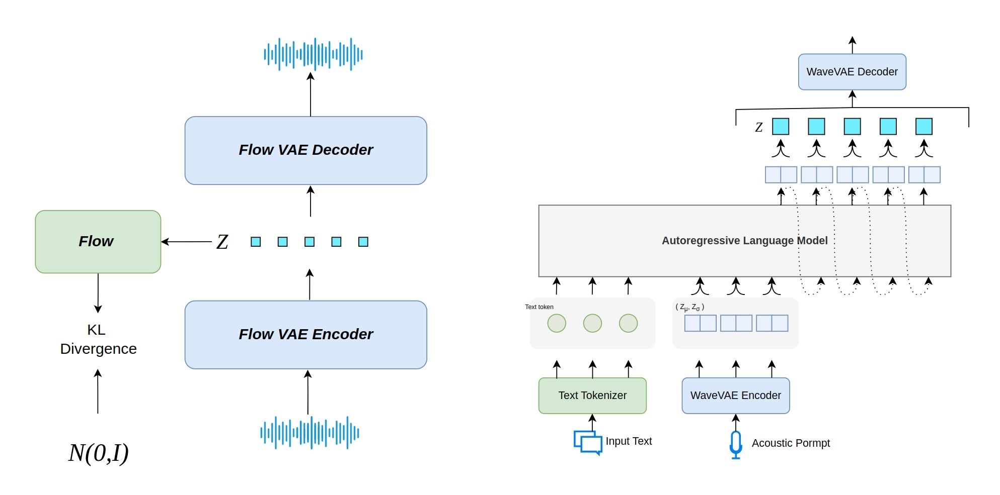

# KALL-E



## Overview

This repository contains the inference utilities for **KALL-E**, a text-to-speech
system that predicts continuous speech representations using a single
autoregressive language model.

## Key Features

- **Autoregressive Language Modeling**: Utilizes an autoregressive approach for next-distribution prediction in text-to-speech synthesis.
- **Continuous Speech Distribution**: Directly models and predicts continuous speech distributions conditioned on text, avoiding reliance on diffusion-based components.
- **FlowVAE**: Employs FlowVAE to extract continuous speech distributions from waveforms, rather than using discrete speech tokens.
- **Single AR Language Model**: Uses a single autoregressive language model to predict continuous speech distributions from text, constrained by Kullback-Leibler divergence loss.
- **Simplified Paradigm**: Offers a more straightforward and effective approach for using continuous speech representations in TTS.

## Performance

Results on the seedstts-eval test set for four target speakers

| target_speaker      | zh CER | zh SIM | en WER | en SIM |
|---------------------|-------:|-------:|------:|-------:|
| --                  | 0.95   | --     | 1.68  | --    |
| 70                  | --     | --     | 2.25  | 0.701 |
| 159                 | --     | --     | 2.40  | 0.733 |
| aishell3-SSB0341    | 0.95   | 0.710  | --    | --    |
| didispeech-00010111 | 1.02   | 0.750  | --    | --    |


## Environment Setup

- Python 3.8 or higher
- PyTorch with CUDA support
- Transformers
- NumPy
- SciPy
- alias-free-torch

Install the dependencies with:
```bash
pip install torch transformers numpy scipy alias-free_torch
```

## Usage Example

After placing the pretrained checkpoints under `./checkpoints`, execute:
```bash
python infer_from_prompt.py --speaker aishell3-SSB0341 --text "你好，今天天气很好。" --model ./checkpoints/kalle_model.pt --output output.wav
```

The generated audio will be saved to `output.wav`.
